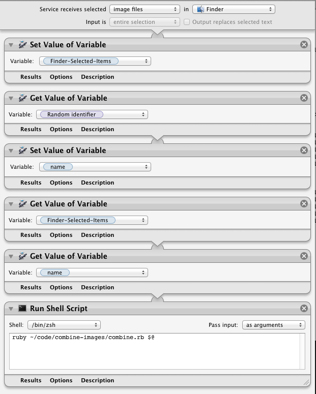

# Combine Images

Every have a need to combine side by side screenshots? With this script it is as easy as selecting your photos and using a service.

## Requirements

This script is dependent on:

* Ruby - to run the script.
* [ImageMagic](http://www.imagemagick.org/script/index.php) - processes the image. Easiest to do with Homebrew.
* Mac - If you want to use it as a service

## Installing

1. Clone the repo
2. Install the Automator script
3. Modify the automator script to point to the file in your repo

That should be it.

